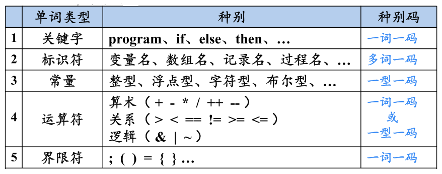
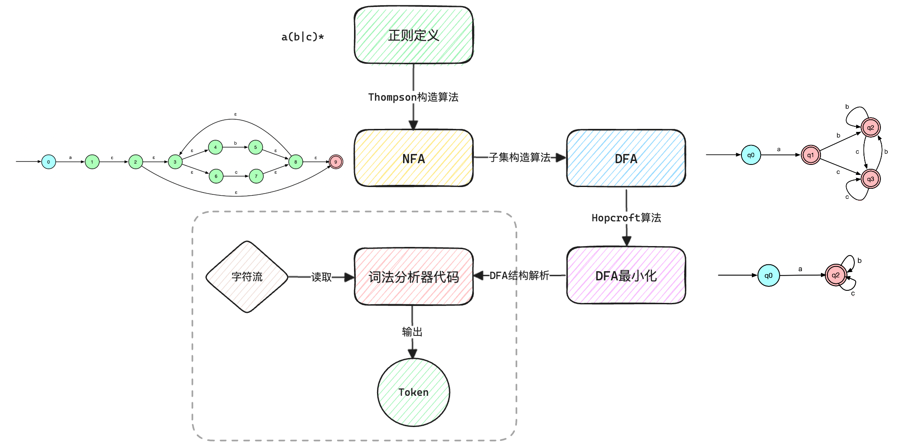
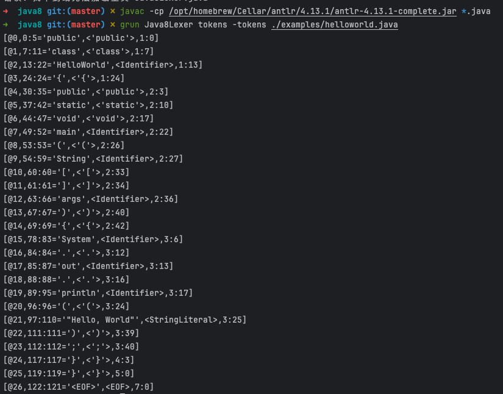
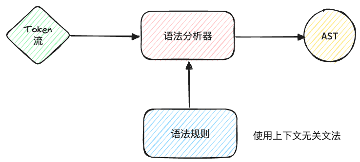
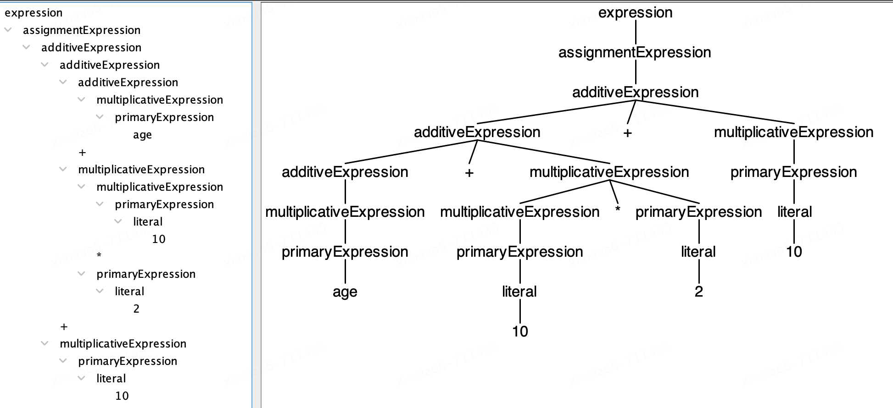
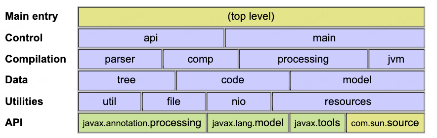

# 编译器前端
编译器前端主要包含：词法分析、语法分析和语义分析。

## 1. 词法分析（Lexical Analysis，or Scanning）
### 1.1 理论知识
词法分析又称扫描(scanning)，通过读入组成源程序的字符流，将它们组织成为有意义的词素(lexeme)的序列。词素是源程序中的最小语言单位，如关键字、标识符、常数、操作符和分隔符等。对于每个词素，词法分析器将产生对应的词法单元(token)作为输出。

**token:<种别码，属性值>**



词法分析器的核心逻辑基于[有限自动机](https://zh.wikipedia.org/wiki/%E6%9C%89%E9%99%90%E7%8A%B6%E6%80%81%E6%9C%BA)（Finite Automata），可以理解为有限个状态的自动执行机器，用来将扫描得到的字符映射到有限个的可能性上。类型包括：
- **不确定性有限自动机（NFA）**：在某状态和输入符号下可能存在多个可能的转移状态；
- **确定性有限自动机（DFA）**：在任何状态和输入符号下都只有一个唯一的转移状态。

整个自动构造过程见下图，大致了解一下即可，如果想深入学习各种算法细节可自行查阅资料。



### 1.2 实践一下
接下来我们练练手，使用Antlr对Java源码进行词法分析。[Antlr](https://www.antlr.org/)是一个开源工具，支持根据规则文件生成词法分析器和语法分析器，它自身是用 Java 实现的，Mac上可以使用Homebrew安装或者直接使用idea插件[antlr-v4](https://plugins.jetbrains.com/plugin/7358-antlr-v4)。同时[grammars-v4](https://github.com/antlr/grammars-v4)上提供了很多供参考的规则，我们这里也直接使用其中针对Java8定义的词法分析规则练手。
- 词法规则定义：[Java8Lexer.g4](https://github.com/antlr/grammars-v4/blob/master/java/java8/Java8Lexer.g4)
```
- 关键字定义
ABSTRACT     : 'abstract';
ASSERT       : 'assert';
BOOLEAN      : 'boolean';
BREAK        : 'break';
BYTE         : 'byte';
CASE         : 'case';
CATCH        : 'catch';
CHAR         : 'char';
...

- 字符串字面量定义
StringLiteral: '"' StringCharacters? '"';
fragment StringCharacters: StringCharacter+;
fragment StringCharacter: ~["\\\r\n] | EscapeSequence;
...
```
- 待解析的Java代码
```java
public class HelloWorld { 
   public static void main(String[] args) { 
      System.out.println("Hello, World");
   }
}
```
- 使用Antlr生成词法分析器并执行分析操作
```Bash
# ① 编译词法规则
antlr Java8Lexer.g4 
# ② 编译上一步生成的java文件（注意需要把Antlr的JAR文件设置到CLASSPATH环境变量，否则会报错）
javac Java8Lexer.java
# ③ 调用生成的词法分析器获取分析结果
grun Java8Lexer tokens -tokens ./examples/helloworld.java 
```



## 2. 语法分析（Syntactic Analysis, or Parsing）
### 2.1 理论知识
语法分析又称解析（parsing），它在词法分析后执行。将tokens组织成语法结构，通常是一棵抽象语法树（Abstract Syntax Tree, AST），这棵树表示了源代码的语法结构。语法分析器需要根据一组预定义的语法规则来分析词法单元序列。这些规则通常以上[下文无关文法](https://zh.wikipedia.org/wiki/%E4%B8%8A%E4%B8%8B%E6%96%87%E6%97%A0%E5%85%B3%E6%96%87%E6%B3%95)（Context-Free Grammar, CFG）的形式定义，其中每个规则定义了语言中的一个结构如何由其他结构组成。



这里先简单说一下CFG，如果想深入学习可以再查查资料。一个上下文无关文法由以下四个部分组成：
- ① **非终结符（Non-terminals）**：这些是文法的变量，表示一组字符串的集合。它们通常用大写字母表示，如A,B,Expr等；
- ② **终结符（Terminals）**：这些是文法的基本符号，它们构成了语言的字符串。在编程语言中，终结符可以是关键字、操作符、标识符等。它们通常用小写字母、数字或其他符号表示；
- ③ **产生式规则（Production rules）**：这些规则定义了非终结符如何被终结符或其他非终结符的序列替换。规则的形式通常是A → B C，表示非终结符A可以被B C替换；
- ④ **开始符号（Start symbol）**：这是一个特殊的非终结符，用于表示整个语言或文法的起始点。

举个栗子：
```
S → a S b
S → ε
-------解释--------
·非终结符是S
·终结符是a和b
·产生式规则有两条：S → a S b 表示 S 可以被 a S b 替换，S → ε 表示 S 可以被空字符串替换（ε 表示空字符串）
·开始符号是S
这个文法生成的语言是所有a和b的平衡字符串，例如：ab、aabb、aaabbb 等。
```

语法分析的核心能力是**给定文法G和句子s，回答s是否能够从G推导出来**。实现的方式可以大致分为自底向上和自顶向下的语法分析：
- ① **自顶向下语法分析**：从树的顶部（即开始符号）开始构建解析树的过程。在这种方法中，解析器尝试找出输入字符串可以从哪个产生式开始，并逐步展开这些产生式，直到获得完整的输入字符串。自顶向下解析的特点是直观、易于实现，尤其是对于简单的文法。然而，它们可能无法处理[左递归](https://zh.wikipedia.org/wiki/%E5%B7%A6%E9%81%9E%E6%AD%B8)文法，且对于复杂的文法可能不够高效。常见的算法有“[递归下降解析](https://zh.wikipedia.org/wiki/%E9%80%92%E5%BD%92%E4%B8%8B%E9%99%8D%E8%A7%A3%E6%9E%90%E5%99%A8)”和“[LL解析](https://zh.wikipedia.org/zh-cn/LL%E5%89%96%E6%9E%90%E5%99%A8)”，算法的详细过程这里就不分析了，大家可以查查资料或者问一下GPT。
- ② **自底向上语法分析**：从树的底部（即输入字符串）开始构建解析树的过程。在这种方法中，解析器尝试找出输入字符串的哪些部分可以对应文法的某个产生式的右侧，并将其规约为产生式的左侧，逐步减少整体的长度，直到最终规约为开始符号。自底向上解析通常比自顶向下解析更强大，因为它们可以处理更复杂的文法，包括那些自顶向下解析器无法处理的文法。然而，它们的解析表通常更为复杂，且实现起来可能更为困难。常见的算法有“[LR解析](https://zh.wikipedia.org/wiki/LR%E5%89%96%E6%9E%90%E5%99%A8)”。

### 2.2 实践一下
了解了基本概念后我们还是练练手，使用Antlr对Java源码进行语法分析。这次就不使用grammars-v4中定义的语法规则了，因为编程语言的语法规则比较复杂最后生成的AST可读性比较差。
- 语法规则定义
(词法规则定义：[CommonLexer.g4](https://github.com/RichardGong/PlayWithCompiler/blob/master/lab/antlrtest/src/antlrtest/CommonLexer.g4)，语法规则定义：[PlayScript.g4](https://github.com/RichardGong/PlayWithCompiler/blob/master/lab/antlrtest/src/antlrtest/PlayScript.g4))
```
grammar PlayScript;
import CommonLexer;   //导入词法定义

/*下面的内容加到所生成的Java源文件的头部，如包名称，import语句等。*/
@header {
package antlrtest;
}

expression
    :   assignmentExpression
    |   expression ',' assignmentExpression
    ;

assignmentExpression
    :   additiveExpression
    |   Identifier assignmentOperator additiveExpression
    ;

assignmentOperator
    :   '='
    |   '*='
    |  '/='
    |   '%='
    |   '+='
    |   '-='
    ;

additiveExpression
    :   multiplicativeExpression
    |   additiveExpression '+' multiplicativeExpression
    |   additiveExpression '-' multiplicativeExpression
    ;

multiplicativeExpression
    :   primaryExpression
    |   multiplicativeExpression '*' primaryExpression
    |   multiplicativeExpression '/' primaryExpression
    |   multiplicativeExpression '%' primaryExpression
    ;
```
- 使用Antlr生成语法分析器并执行分析操作
```Bash
# ① 编译语法规则
antlr PlayScript.g4
# ② 编译上一步生成的java文件（注意需要把Antlr的JAR文件设置到CLASSPATH环境变量，否则会报错）
javac *.java
# ③ 调用生成的语法分析器获取分析结果（输入表达式后使用^D触发AST图生成）
grun antlrtest.PlayScript expression -gui
age + 10 * 2 + 10
^D
```



## 3. 语义分析（Semantic Analyzer）
### 3.1 理论知识
语义分析器(semantic analyzer)使用语法树和符号表中的信息来检查源程序是否和语言定义的语义一致。它同时也收集类型信息，并把这些信息存放在语法树或符号表中，以便在随后的中间代码生成过程中使用。语义规则一般包括但不限于：
- **类型检查**：确保操作数的类型与操作符兼容，例如不允许将整数赋值给字符串类型的变量；
- **变量绑定**：确保变量和函数的声明与使用匹配，变量在使用前已被声明，函数调用时参数的数量和类型与声明相符；
- **控制流检查**：确保程序中的控制流语句（如循环和条件语句）的使用是合法的；
- **唯一性检查**：确保标识符的声明在同一作用域内是唯一的，例如不允许在同一作用域内声明两个相同名称的变量；
- **权限和可访问性检查**：确保对变量和函数的访问符合其声明的权限，例如私有成员只能在其类内部被访问。

由于每种语言都有其独特的语义规则和特性，例如类型系统、作用域规则、合法的操作符重载等都是语言特定的。因此，语义分析必须针对每种语言的规范来设计。
### 3.2 实践一下
由于不同语言的语义分析实现差异较大，没有通用的语义分析器生成工具。因此我们直接来阅读一下Java编译器中的相关源码，了解一下实现逻辑。javac中语义分析的源码位于com.sun.tools.javac.code和com.sun.tools.javac.comp包中。



以下列举了一些用于语义分析的类，源码就不贴了，可以在[langtools](https://hg.openjdk.org/jdk8/jdk8/langtools/)下载阅读：
- **Symbol**：表示所有的语言符号，包括变量、方法、类等。这些符号在编译过程中被创建并填充到符号表中；
- **Scope**：用于管理作用域，它保存了一个作用域内所有的符号。这对于解析变量名和方法名非常重要，以确保它们在当前上下文中是可见的和有效的；
- **Type**：代表Java语言中的所有类型，包括基本类型、类和接口类型、数组类型等。javac在类型检查过程中使用这个类来确定类型兼容性和执行类型转换；
- **Attr**：进行属性分析的核心类，它负责将类型信息和其他属性关联到语法树的节点上。它执行类型检查、方法解析和变量捕获等任务；
- **Check**：用于执行各种语义检查，例如检查类型是否存在循环继承，或者一个类是否实现了其接口的所有方法；
- **Resolve**：用于解析方法调用、类型名和变量名。它在符号表中查找正确的符号，并处理如方法重载解析等复杂情况；
- **Annotate**：处理注解相关的语义分析，包括注解的解析和应用；
- **Types**：提供了一组用于类型操作的实用方法，如确定一个类型是否可以赋值给另一个类型，或者查找最近公共祖先类型等；
- **Flow**: 负责进行控制流分析，比如检查变量在使用前是否已经被赋值，或者方法是否总是有返回值；
- **LambdaToMethod**：Java 8 引入了 Lambda 表达式，这个类负责将 Lambda 表达式转换为匿名类或静态方法；
- **TransTypes**和**Lower**: 这些类负责某些类型转换，包括泛型的桥接方法和自动装箱/拆箱。