# 编译器中端
编译器中端主要包括：中间代码生成和中间代码优化。
## 1. 中间代码生成
### 1.1 为什么需要中间代码？
编译器很难通过一次处理就得到最优的目标代码，实际的编译器大多组织为一连串的处理趟，每一趟处理的结果又作为下一趟的输入持续的运行。随着编译器不断推导有关被编译代码的知识，它必须将这些信息从一趟传递到另一趟。因此，这些**能推导出有关程序全部事实的信息**需要一种表示方式，称之为中间代码或**中间表示**(intermediate representation)，简称IR。    
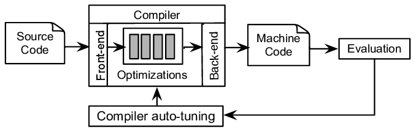

广义上可以将源码到目标代码之间的表达形式都称之为中间代码。其目的是为了解耦编译器前端和后端部分，作为高级语言和目标机器语言之间的桥梁，不依赖于特定的源语言或目标机器使得一些代码优化动作能够复用。与高级语言相比，IR 丢弃了大部分高级语言的语法特征和语义特征，比如循环语句、if 语句、作用域、面向对象等等，它更像高层次的汇编语言；而相比真正的汇编语言，它又不会有那么多琐碎的、与具体硬件相关的细节。    
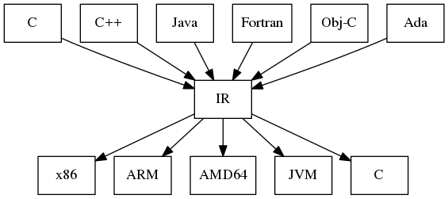

如果源语言语法结构较为简单，编译器可能会用唯一的IR，但如果源语言语法结构比较复杂，则在转换为目标语言的过程中可能会使用了一系列的IR，并通过转换进行大量的优化操作。    
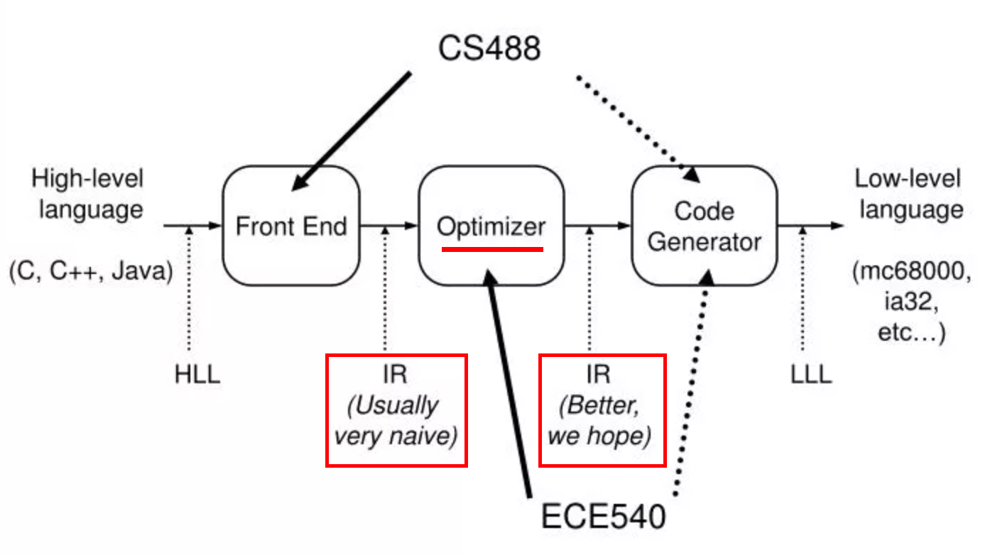

由于不同语言编译器中IR差异较大，本文后续内容对于概念部分只做点到即止的阐述，但增加了LLVM的中间代码实操用来加深理解。LLVM 是一个开源的编译器基础设施项目，主要聚焦于编译器的后端功能（代码生成、代码优化、JIT……），其在业界被广泛应用，很多语言都是基于它实现的，更多信息可以查看[官网](https://llvm.org/)。    
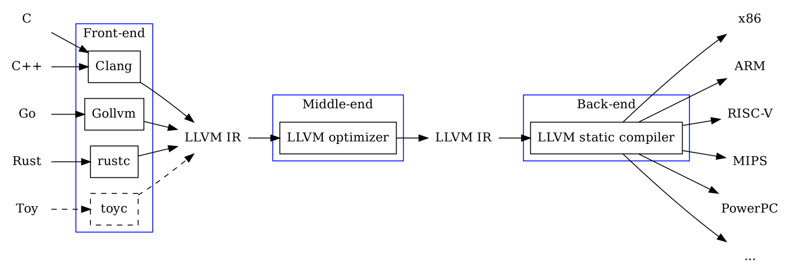
### 1.2 中间代码分类
按照与源代码接近的程度可以分为：
- **高级IR**：更接近源代码，保留了更多的源代码层面的信息，如数据类型、控制结构等。通常用于编译器前端的语义分析和初步优化阶段。例如：AST等；
- **中级IR**：开始脱离源代码的具体语法，引入更多与机器无关的优化。通常用于进行编译器的主要优化，如循环优化、常量传播、死代码消除等。例如：TAC等；
- **低级IR**：接近目标机器代码，更多地反映了目标平台的具体特性，如寄存器、指令集等。用于编译器后端的优化，特别是那些与目标机器密切相关的优化，如寄存器分配、指令选择和调度。    

根据其结构和表现形式可以分为：
- **图IR**： 将编译器生成的信息保存在图中，通过图结构来表示程序的各种属性。图IR非常适合表示并分析程序的复杂结构，如循环、分支等。例如：AST、CFG和DFG等；
- **线性IR**： 以线性的方式表示程序，通常是一系列的指令或语句。不像图IR那样直观地表示控制流或数据流，但对于某些分析和转换来说更简单、直接，常用于编译器的早期阶段，进行简化的分析和转换。例如：TAC、SSA等；
- **混合IR**： 结合了图IR和线性IR的特点，尝试兼顾两者的优势。一种常见的混合表示为使用线性IR来表示无循环代码的块，使用图来表示这些块之间的控制流。混合IR旨在提供足够的灵活性来支持各种编译阶段的需要，从而使编译器能够有效地执行复杂的优化和分析。

了解了基本的分类，下面介绍几种常见的中间表示方式，并针对表达式A进行不同形式的呈现：
```
//表达式A
a=(-b+c*d)+c*d
```

**① 抽象语法树（Abstract Syntax Tree, AST）**
通过编译器前端生成的抽象语法树也算是高级IR和图IR，它保留了源代码的语法结构，如表达式、语句、函数定义等。这里就不再赘述生成过程，如果忘记了相关知识可以再复习一下前文。表达式A对应的AST为：    
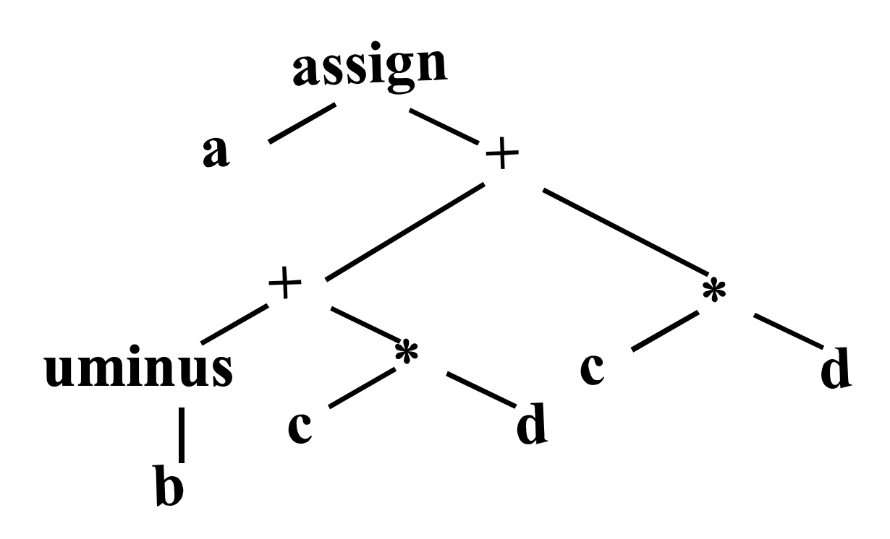

**② 有向无环图（Directed Acyclic Graph，DAG）**
有向无环图是在树结构的基础上，消除了冗余的子树。其结点可以有多个父结点，相同子树可以被重用，可以理解为是一种具有共享机制的AST。表达式A对应的DAG为：    
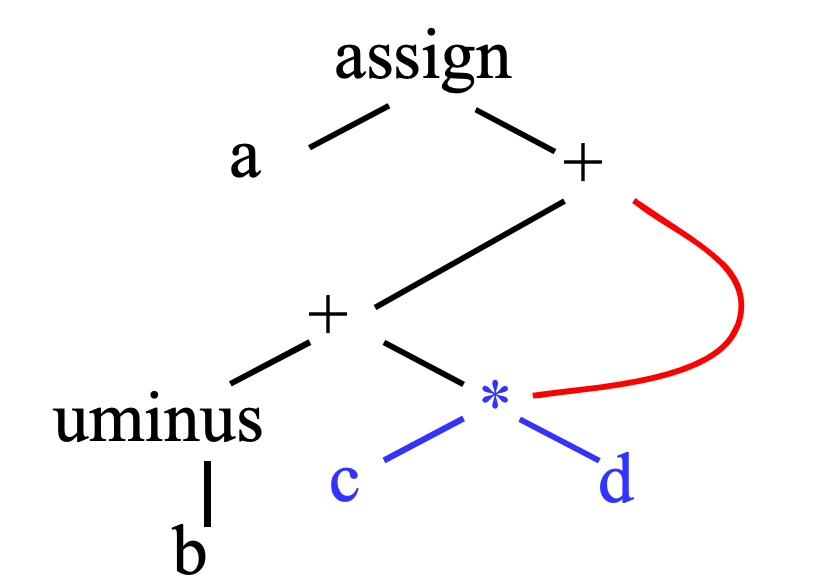

**③ 三地址代码（Three-Address Code, TAC）**
三地址代码是中级IR和线性IR，它是一种接近于汇编语言但又保持了高级语言特征的代码形式。这种形式的IR特别适合于执行和表示各种编译时优化。在三地址代码中，每条指令通常涉及到两个操作数（y、z）和一个结果（x），指令的一般形式可以是：    
**x = y op z**    
其中，op 是一个二元运算符，y 和 z 是操作数，可以是常量、变量或者临时变量，x 是存放结果的变量或临时变量。三地址代码也支持一元运算符，这种情况下指令的形式为：    
**x = op y**     
常用的三地址代码有：    
| 指令类型 | 指令形式 | 备注 |
|-------|-------|-------|
| 赋值指令 | x = y op z、x = op y | op为运算符 |
| 复制指令 | x = y |  |
| 条件跳转 | if x relop y goto n | relop为关系运算符 |
| 非条件跳转 | goto n | 跳转到地址n的指令 |
| 参数传递 | param x | 将x设置为参数 |
| 过程调用 | call p,n | p为过程的名字，n为过程的参数的个数 |
| 过程返回 | return x | |
| 数组引用 | x=y[i] | i为数组的偏移地址，而不是下标 |
| 数组赋值 | x[i]=y | |
| 地址及指针操作 | x=&y、x=*y*x=y | |

表达式A对应的TAC为（可以通过遍历AST生成TAC）：    
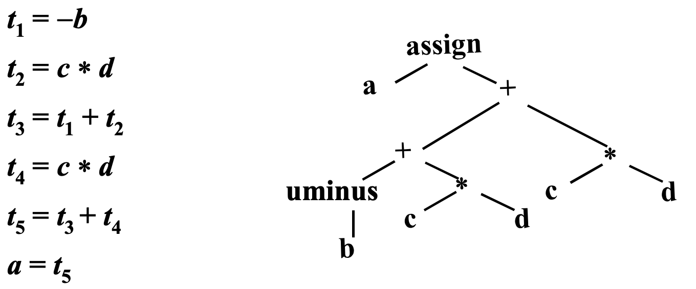

**④ 静态单赋值形式（Static Single Assignment, SSA）**
静态单赋值形式也是一种线性IR，它和三地址代码的主要区别在所有赋值指令都是对不同名字的变量的赋值。每个变量很确定地只会被定义一次，然后可以多次使用。这种特点使得基于SSA更容易做数据流分析，而数据流分析又是很多代码优化技术的基础，所以几乎所有语言的编译器、解释器或虚拟机中都使用了SSA。下图展示了两种表示方式的区别：    
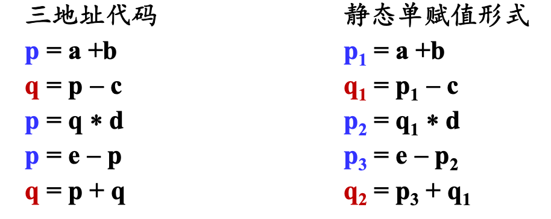

另外，表达式A生成的TAC和SSA是一样的，大家不妨验证一下是否符合SSA的特性😁。

除了上述中间表示形式外还有CFG、CallGraph等更复杂的IR这里就不展开说了，有兴趣的同学可以自行查阅资料。    
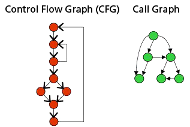
### 1.3 中间代码生成实践
LLVM IR是一种基于静态单赋值（SSA）的表示法，提供了类型安全、底层操作、灵活性以及简洁地表示 高级语言的能力。它实际上有三种不同的表示方式，它们在功能上是等价的，但用途和表现形式各有不同。这三种表示分别是：
- **LLVM汇编语言**（LLVM Assembly Language）：这是一种文本格式的表示，提供了可读性较好的代码形式。它允许开发者和工具以文本形式查看和编辑IR，非常适合调试和教学。这种格式通常保存为以.ll为扩展名的文件；
- **LLVM字节码**（LLVM Bitcode）：这是一种二进制格式的表示，它将IR编码为二进制文件，通常用于在不同编译阶段之间传递IR，或者作为发布应用程序的一部分以支持延迟编译（JIT编译）或跨平台移植。字节码格式更加紧凑，加载和处理速度也更快。这种格式的文件扩展名通常是.bc。
- **内存中的IR**（In-memory IR）：这是LLVM库在内存中操作的数据结构形式。当- LLVM的前端（如Clang）解析源代码时，它会构建出一个内存中的IR表示，后续的优化和转换操作都是在这种形式上进行的。这种表示不直接面向用户，而是由LLVM的API操作和修改。

下面实操使用LLVM工具生成这.bc和.ll这两种中间代码：    
**① 安装LLVM**    
可以参考[官方下载地址](https://releases.llvm.org/)安装，Mac可以使用HomeBrew安装。
```Bash
brew install llvm
```
由于LLVM 带了一个版本的 Clang 和 C++ 的标准库，与本机原来的工具链可能会有冲突，所以 brew 安装的时候并没有在 /usr/local 下建立符号链接。使用 LLVM 工具的时，要配置好相关的环境变量。
```Bash
# 可执行文件的路径
export PATH="/usr/local/opt/llvm/bin:$PATH"
# 让编译器能够找到LLVM
export LDFLAGS="-L/usr/local/opt/llvm/lib"
export CPPFLAGS="-I/usr/local/opt/llvm/include"
```

**② 准备源码文件fun1.c**    
```C
int fun1(int a, int b){
    int c = 10;
    return a+b+c;
}
```
**③ 生成IR**
```Bash
# 生成LLVM汇编语言
clang -emit-llvm -S fun1.c -o fun1.ll
# 生成LLVM字节码
clang -emit-llvm -c fun1.c -o fun1.bc
```
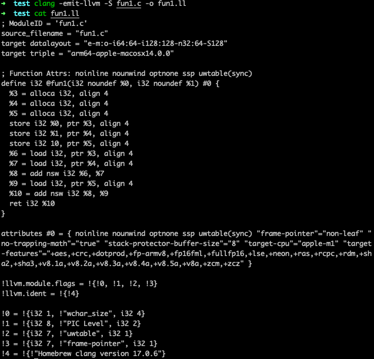

**④ IR转换**    
两种中间代码可以互相转换，我们将前面生成的.ll转换为.bc。    
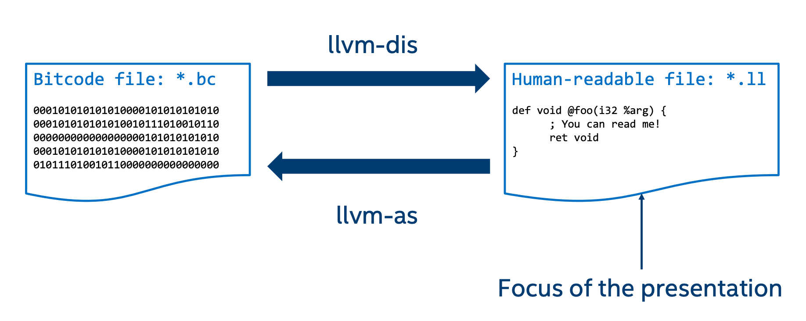
```Bash
# 转换命令
llvm-as fun1.ll -o fun1.bc
# 查看结果
hexdump -C fun1.bc
```
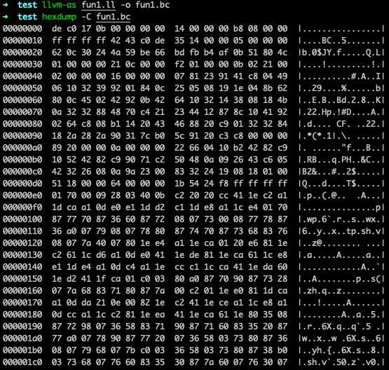

## 2. 中间代码优化
### 2.1 常见优化方式
IR存在的意义是使得代码优化变得容易且可复用，不同的中间表达方式也是为了方便不同优化手段的执行。对代码做优化的方法有很多，如果把它们分类一下的话，可以按照下面两个维度：
- **按是否机器相关分类：**
    - **机器无关优化**（Machine-Independent Optimization）：这类优化不依赖于目标机器的具体硬件特性，主要关注于高级语言构造的改进和通用的算法改进。例如：常量折叠、死代码消除、循环不变代码外提等；
    - **机器相关优化**（Machine-Dependent Optimization）：这类优化依赖于目标机器具体硬件特性，如寄存器的数量、指令集特点等。例如：寄存器分配、指令选择、指令级并行优化等。
- **按优化的范围分类：**
    - **本地优化**（Local Optimization）：关注于程序中小的片段，通常是一个基本块内的优化。这类优化不考虑跨基本块的控制流和数据流。例如：公共子表达式消除、死代码消除等；
    - **全局优化**（Global Optimization）：考虑整个程序或函数的控制流和数据流，跨多个基本块进行优化。例如：全局常量传播、全局死代码消除等；
    - **过程间优化**（Interprocedural Optimization, IPO）：涉及多个函数或过程，优化的范围超越单个函数的边界。例如：内联展开、过程间常量传播等。

中间代码优化属于机器无关，针对本地、全局和过程间都可以进行优化。下面介绍一些常见的优化方式，之后再使用LLVM进行优化实操。

**① 常量折叠（Constant Folding）**    
预先计算常量表达式的结果，而不是在运行时计算。编译器会分析代码中的表达式，如果发现表达式完全由常量组成，编译器就会预先计算这个表达式的结果，并在生成的代码中用这个计算结果替换原有的表达式。这个过程不改变程序的语义，因为替换后的表达式和原表达式在逻辑上是等价的。例如：
```C
int main() {
    int a = 2 + 3;
    int b = a * 10;
    return b;
}
```
上述代码表达式 2 + 3 完全由常量组成，因此编译器在编译时就可以计算出它的结果为5。因此替换后生成：
```C
int main() {
    int a = 5;
    int b = a * 10;
    return b;
}
```
接着，虽然 a 不是一个字面常量，但是在上下文中它的值是已知的，因此表达式 a * 10 也可以在编译时被计算出结果为50。最终，代码可以被优化为：
```C
int main() {
    return 50;
}
```

**② 死代码消除（Dead Code Elimination）**    
移除那些不会影响程序最终结果的代码。这种优化不仅可以减少程序的大小，还能提高执行效率，因为它减少了执行时的计算量和内存占用。死代码的类型有：
- 不可达代码：这类代码在任何情况下都不会被执行到。例如，在条件判断后的某个分支中，如果条件永远不会满足，则该分支中的代码就是不可达代码；
```C
int func(int x) {
    return x * 2;
    printf("This line will never be executed.\n"); // 此行是死代码
}
```
- 无效果表达式：这类代码虽然会被执行，但是不会对程序的状态或输出产生任何影响。比如，对局部变量的赋值，如果这个局部变量之后没有被读取，那么这个赋值操作就是无效果的。
```C
void example() {
    int a = 10;
    a = 20; // 这个赋值是死代码，因为a的值没有被使用
    // 函数结束，没有任何对a的引用
}
```

**③ 公共子表达式消除（Common Subexpression Elimination, CSE）**    
识别并消除在程序中多次计算的相同表达式，从而减少重复计算，提高程序的运行效率。这种技术识别在一段代码中多次出现的相同表达式，然后将这个表达式的计算结果保存在一个临时变量中，后续使用这个结果而不是重新计算表达式。举例：
```C
int a = b * c + g;
int d = b * c * e;
```
上述代码b * c 被计算了两次。通过公共子表达式消除，我们可以将b * c的结果存储在一个临时变量中，然后复用这个结果：
```C
int temp = b * c;
int a = temp + g;
int d = temp * e;
```

**④ 循环展开（Loop Unrolling）**    
减少循环迭代次数，从而提高程序的执行效率。循环展开通过减少循环迭代次数来实现，它将循环体中的操作复制多份，每次迭代执行更多的工作，从而减少了循环控制逻辑（比如增量和条件测试）的开销。举例：
```C
int sum = 0;
for (int i = 0; i < 100; i++) {
    sum += array[i];
}
```
展开这个循环，每次迭代处理两个元素：
```C
int sum = 0;
for (int i = 0; i < 100; i += 2) {
    sum += array[i];
    sum += array[i + 1];
}
```

**⑤ 循环不变代码外提（Loop Invariant Code Motion）**    
将循环内部那些在每次迭代中都不会改变的计算移动到循环外部执行，从而减少了循环内部的计算量，提高了程序的效率。举例：
```C
for (int i = 0; i < n; i++) {
    if (b > 0) {
        array[i] = b * array[i];
    }
}
```
如果b的值在循环过程中不改变，那么if (b > 0)的判断结果是不变的。将这个判断移到循环外部，这样如果b小于等于0可以避免整个循环的执行：
```C
if (b > 0) {
    for (int i = 0; i < n; i++) {
        array[i] = b * array[i];
    }
}
```

**⑥ 内联展开（Inline Expansion）**    
将函数调用替换为函数体本身的代码，以减少函数调用开销。这种技术的目的是减少函数调用时产生的额外成本，比如参数传递、栈帧创建和销毁等，从而提高程序的执行效率，也能提高局部性有助于缓存利用。举例：
```C
int square(int x) {
    return x * x;
}

int main() {
    int sum = 0;
    for (int i = 0; i < 10; i++) {
        sum += square(i);
    }
    return sum;
}
```
内联展开后的代码如下，每次循环调用的square函数被替换成了它的函数体：
```C
int main() {
    int sum = 0;
    for (int i = 0; i < 10; i++) {
        sum += i * i; // 直接使用内联后的代码
    }
    return sum;
}
```
### 2.2 中间代码优化实践
生成IR的命令可以直接带上优化参数生成优化后的结果：
```Bash
# 带上 O2 参数来生成优化的 IR
clang -emit-llvm -S -O2 fun1.c -o fun1-O2.ll
```
另外还有一个单独的命令opt用来做代码优化。缺省情况下，它的输入和输出都是.bc 文件，带上 -S 参数则可以直接对.ll 文件进行优化。用 opt --help 命令，可以查看 opt 命令所支持的所有优化算法。
```Bash
opt -O2 fun1.bc -o fun1-O2.bc
opt -S -O2 fun1.ll -o fun1-O2.ll
```
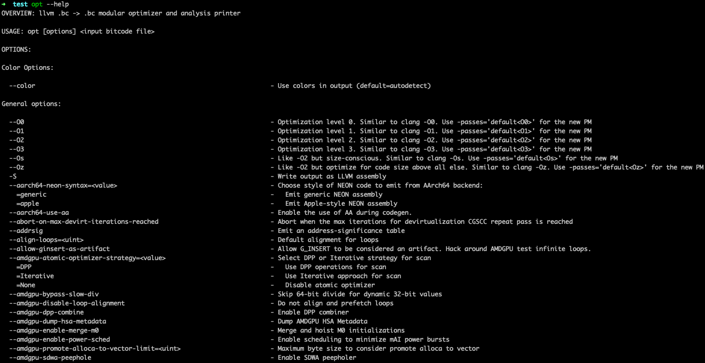

在 LLVM 内部，优化工作是通过一个个的 Pass（遍）来实现的，它支持三种类型的 Pass：
- 分析型的 Pass（Analysis Passes），只是做分析，产生一些分析结果用于后序操作；
- 代码转换的Pass（Transform Passes），比如做公共子表达式删除；
- 工具型的Pass，比如对模块做正确性验证。

个人也可以实现[自定义Pass](https://llvm.org/docs/WritingAnLLVMPass.html)做一些扩展操作，更多Pass相关内容请阅读[LLVM’s Analysis and Transform Passes](https://llvm.org/docs/Passes.html)。    
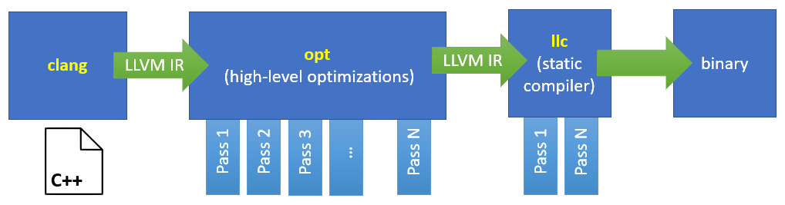

对于前面生成的fun1.ll再执行代码优化操作，查看优化结果可以发现进行了“常量折叠”（执行优化命令前需要将fun1.ll 文件中的“optnone”这个属性去掉，它的意思是不进行代码优化）。    
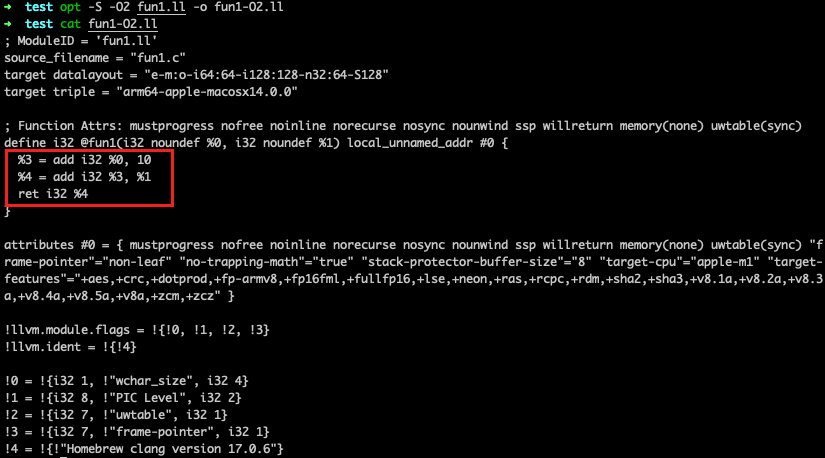