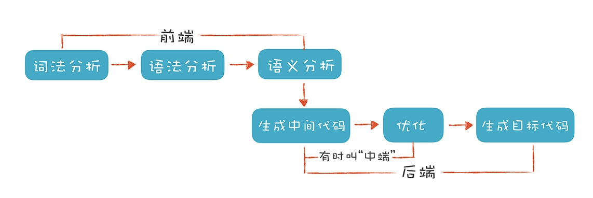

# 编译器（Compiler）

> [编译器](https://en.wikipedia.org/wiki/Compiler)：将用编程语言(源语言)编写的计算机代码翻译成另一种语言(目标语言)的计算机程序。

编译程序属于采用生成性实现途径实现的翻译程序，它以高级程序设计语言书写的源程序作为输入，而以汇编语言或机器语言表示的目标程序作为输出。编译出的目标程序通常还要经历运行阶段，以便在运行程序的支持下运行、加工初始数据，算出所需的计算结果。编译器可能执行以下操作中的一些或全部：预处理、词法分析、语法分析、语义分析、中间代码生成、代码优化和目标代码生成。

和代码可视化相关的主要是编译器前端和中端理论知识，后端部分和目标机器代码、特定机器架构相关一般很少用到可视化中。

### 编译器的工作步骤

