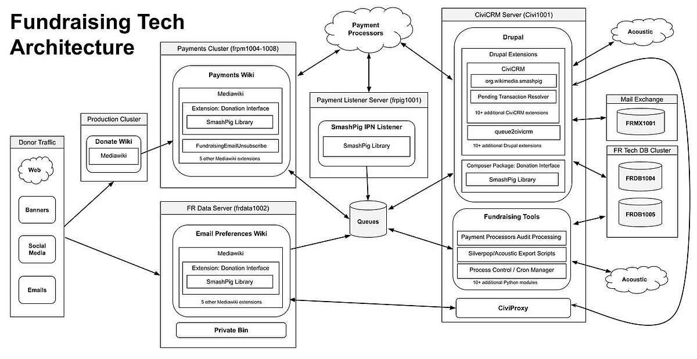
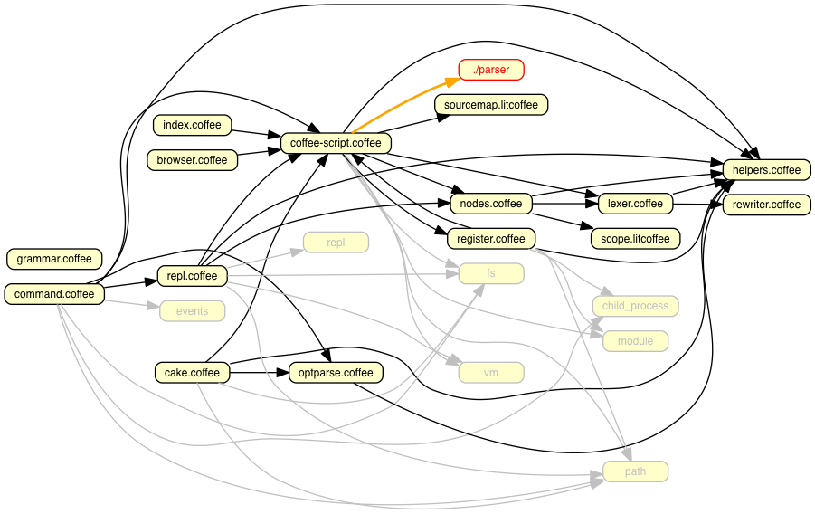
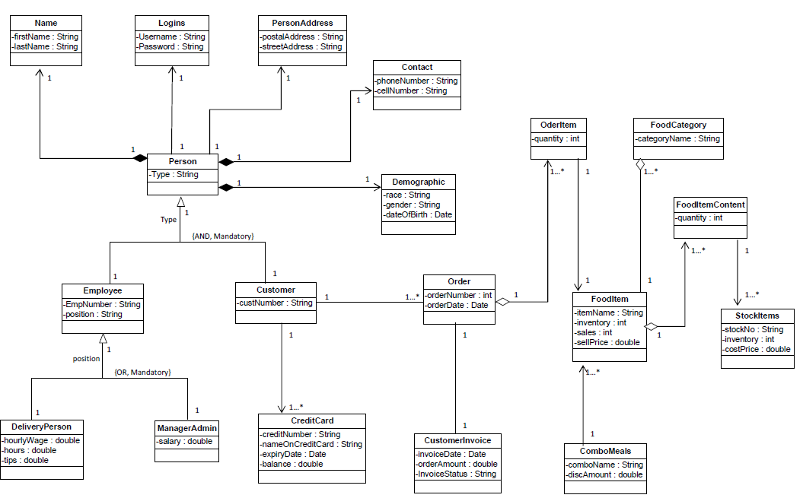
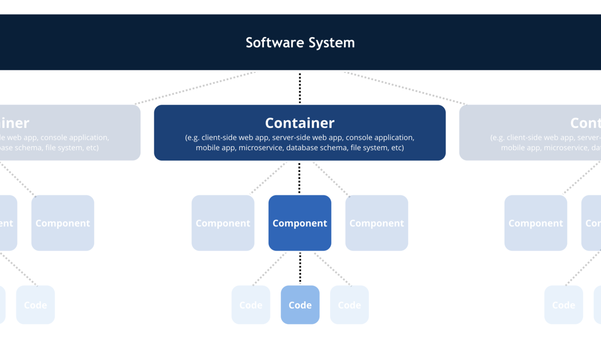
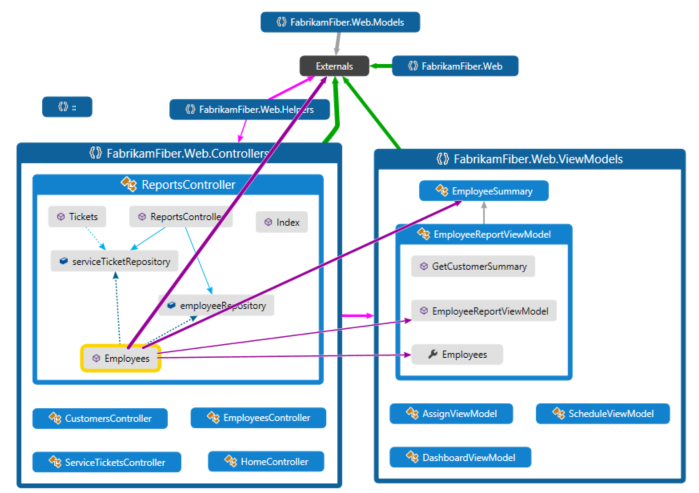
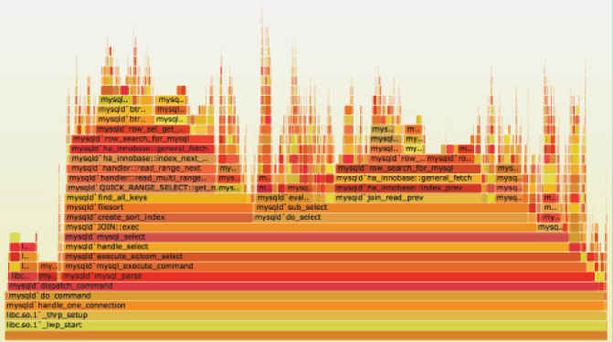
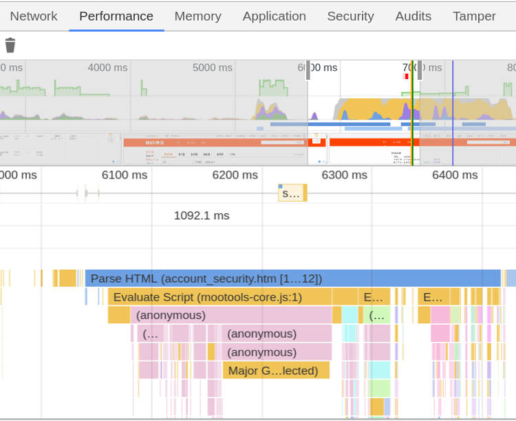
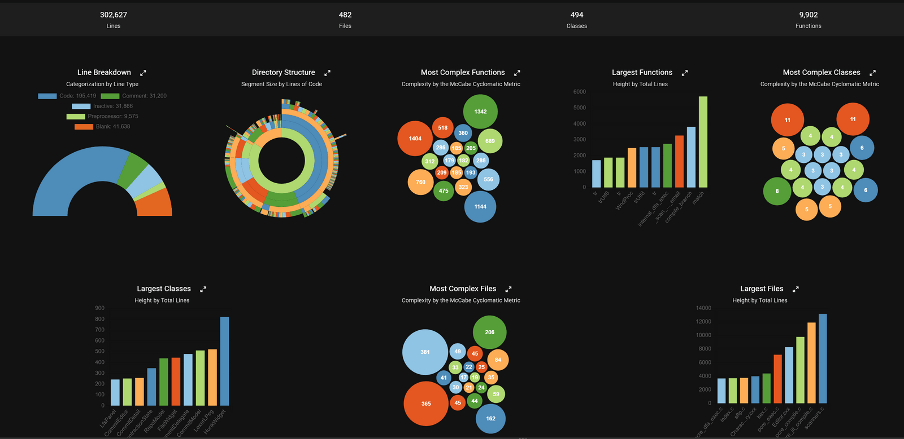

# 可视化图类型

### [架构图（Architecture Diagrams）](https://zh.wikipedia.org/wiki/%E7%B3%BB%E7%BB%9F%E5%85%B3%E7%B3%BB%E5%9B%BE)
> 描述了系统组件如何交互。它从更高的视角上帮助我们了解不同模块之间的数据和控制流向。其内容通常包括模块、类、接口的交互关系。通过可视化架构图，我们可以清晰的了解到需要优化的部分，进行模块解耦并对代码组织做出更好的设计。

### [依赖关系图（Dependency Graphs）](https://en.wikipedia.org/wiki/Dependency_graph)
> 依赖关系图用于描述不同组件（模块、类、方法等）之间的依赖关系。借助它能够识别代码潜在的问题，例如循环依赖关系或过度耦合。通过可视化依赖关系，能发现潜在的优化点并作为重构的抓手，从而保证系统模块化和可维护。

### [UML 图](https://en.wikipedia.org/wiki/Unified_Modeling_Language)
> 提供了一种可视化代码的标准化方法，能轻松地传达复杂的概念。常见类型包括类图：显示类、属性和方法之间的关系;序列图：说明不同对象在流程中的相互作用;活动图：有助于可视化系统内的控制流程。

### [C4 模型](https://en.wikipedia.org/wiki/C4_model)
> 将系统分解为容器、组件等层级，并通过描述他们之间的关系来体现软件系统的架构。C4模型会依靠层级关系分类：
> - 上下文图（Context diagrams）：说明系统之间和使用者的关系。
> - 容器图（Container diagrams）：将系统拆分为容器，容器可以是应用程序或是存储数据。
> - 组件图（Component diagrams）：将容器拆分为组件，描述组件和其他组件（或是其他系统）的关系。
> - 代码图（Code diagrams）：提供架构元素的设计细节，可以深入到具体的代码。此层级会用到其他已有的描述方式，例如：UML、ER图或其他示意图。

### [代码图（Code Maps）](https://learn.microsoft.com/en-us/visualstudio/modeling/map-dependencies-across-your-solutions?view=vs-2022)
> 交互式的显示代码中各结构的关系，让用户无需阅读代码就能了解代码是如何组合在一起的。使用这些图表，可以查看代码的结构和依赖关系，从而估计修改的成本。

### [热图（Heat Maps）](https://en.wikipedia.org/wiki/Heat_map)
> 提供了代码热点的可视化表示，显示出经常被执行或有高复杂度的代码区域。帮助开发者将优化和调试的工作集中最关键的部分。

### 指标可视化（Metrics Visualization）
> 提供多维度代码度量可视化表示，一般包括代码行数、圈复杂度和一些可维护性的指标。趋势的可视化是对项目的变更进行追踪，能清晰地展示代码质量如何演变。

