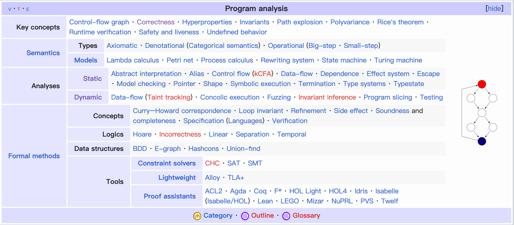

TBD 内容待整理

--- 
相关资料收集：    

原理知识：    
- 静态程序分析    
CFG/DFG/Abstract interpretation/Type systems/Effect systems/Model checking
- 动态程序分析

应用场景：    
- Program optimization | https://en.wikipedia.org/wiki/Program_optimization
- Program correctness | https://en.wikipedia.org/wiki/Correctness_(computer_science)

教程：    
- https://xiongyingfei.github.io/SA_new/2023/
- https://pages.cs.wisc.edu/~reps/
- https://static-analysis.cuijiacai.com/preface/
- https://ranger-nju.gitbook.io/static-program-analysis-book/
- http://staff.ustc.edu.cn/~yuzhang/pldpa/notes/0CourseInfo.pdf