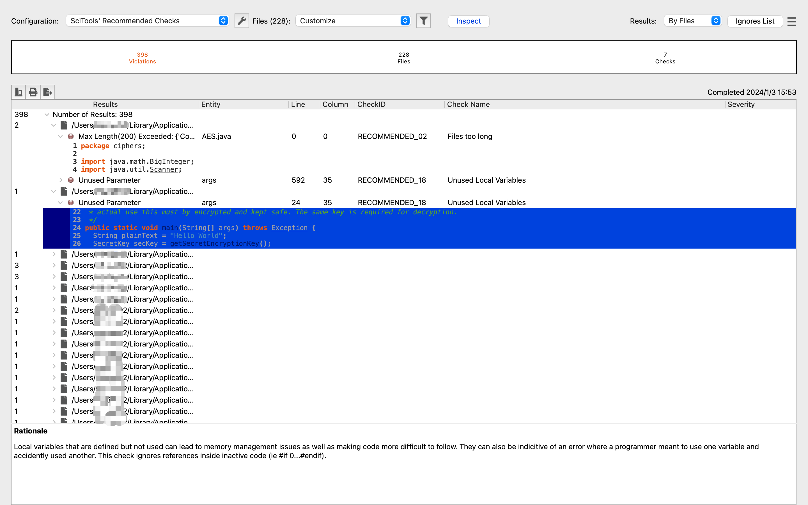
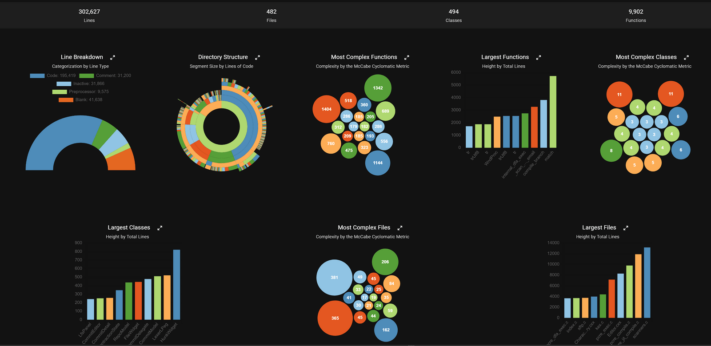

# 代码阅读辅助工具
## [Source Insight](https://www.sourceinsight.com/)

SI使用静态代码分析技术，提供了多个维度代码分析结果展示，对代码阅读、快速查找、代码分析和代码格式化都有帮助。可惜的是只支持Windows系统，Mac如果要使用需要安装虚拟机。

① **代码可视化**：提供各种图形可视化能力，包括继承关系图，CallGraph等；    

- 继承关系图

- CallGraph

② **代码检查**：对于语法格式和样式进行检查；    

③ **代码探索**：查看函数和变量的使用位置；   
自动显示对函数、变量、类等的引用，使用高级搜索功能在整个项目中进行搜索。    

④ **对比分析**：提供了多维度对比分析能力。
- 文件对比

- 目录对比

## [Understand](https://scitools.com/)

Understand使用静态代码分析技术，提供了多个维度的代码分析结果展示，其核心功能和SI类似但更丰富，而且工具易用性更好，也支持多种操作系统。

① **代码可视化**：提供各种图形可视化能力，包括依赖关系图，CallGraph，CFG、UML等等；    

- 控制流程图（CFG）

- CallGraph

- UML

更多可视化图形介绍可参考：[Interesting Graphs about Your Code](https://blog.scitools.com/graphlist/).

② **代码检查**：使用行业、通用或定制化的标准来检查代码，保证其安全、整洁，可用；    

③ **代码量化**：使用各种指标对代码进行度量，如：圈复杂度、度量树状图等度量图表；    
度量树状图中的每个块都代表代码中的一个文件、类或函数。图块的大小和颜色渐变各不相同，以区分度量指标的程度。    

度量图表可提供整个项目的信息，包括最复杂和最大的函数、类和文件等。    

④ **代码探索**：使复杂的代码关系变得简单；    
提供了便捷的搜索功能，能够快速查找及定位指定的标识符。对于函数，可查看返回类型、参数和引用列表，点击后可立即进入该实例。对于类可查看成员变量和函数、包含列表以及相关指标。还可以通过信息浏览窗口或右键单击代码中任何已命名的实体来访问图表。使用蝴蝶图可以快速查看调用或被调用特定函数的所有内容。    

⑤ **代码变更分析**：快速查看两个项目代码之间的差异。    
可以按文件、文件夹、实体或架构维度查看变更。只需要指定要对比的git版本或要对比的两个数据库，便可以以文本或树形图对比的形式查看变更情况。    

## [Source Trail](https://github.com/CoatiSoftware/Sourcetrail)
Sourcetrail是一款开源免费的跨平台源码分析工具，可在阅读源代码时提高效率。提供了按脑图形式展示的函数调用链路。在分析代码的同时，提供了优雅的图形化界面来展示工程项目中的各类标识符信息和链路图，能够让人更为直观地了解整个工程的调用信息。    

PS：此开源项目已在2021年停止维护。

## 其他
- IDE内嵌阅读功能
- [pythontutor](https://pythontutor.com/)    

- [code-understanding-tools](https://github.com/cipher387/code-understanding-tools)

如果你觉得有更好用的工具也请推荐给我~