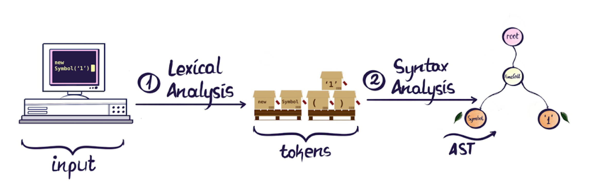
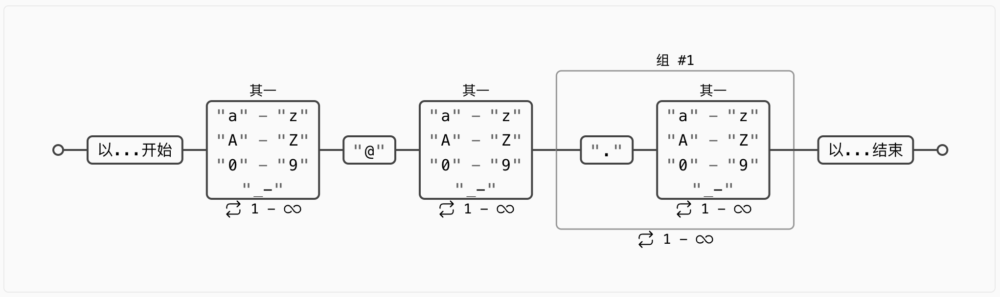
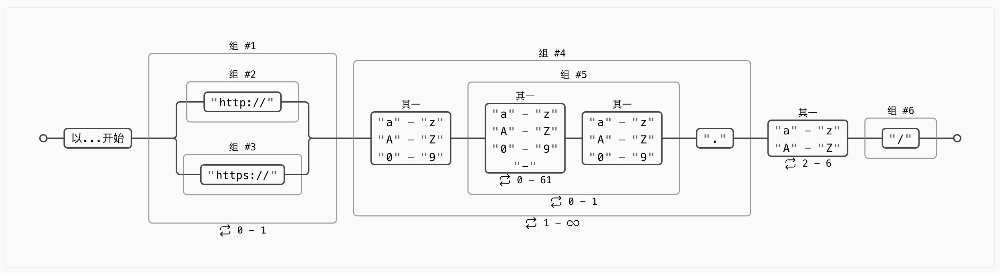
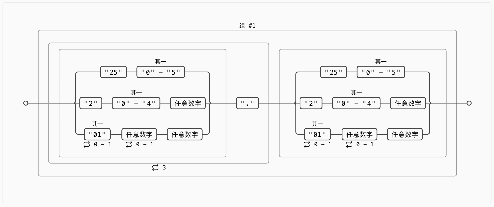
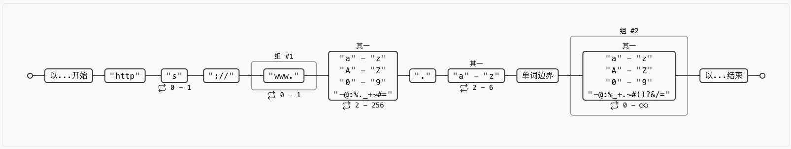
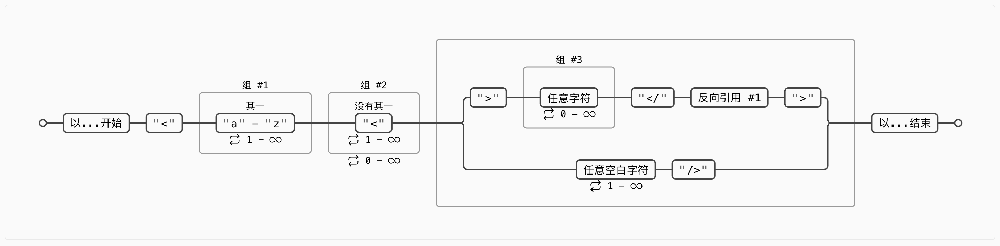

# 正则表达式可视化工具
> [正则表达式](https://zh.wikipedia.org/zh-cn/%E6%AD%A3%E5%88%99%E8%A1%A8%E8%BE%BE%E5%BC%8F)是一种用来匹配字符串的强有力工具。它的设计思想是用一种描述性的语言来给字符串定义一个规则，凡是符合规则的字符串我们就认为它“匹配”了，否则该字符串就是不合法的。

日常开发中常常会使用正则表达式，例如：对数据格式进行校验（判断一个字符串是否是合法的Email格式、合法的IP格式或是否按照特定格式的数字和字母拼接）；又或是将日志详情按照某种格式匹配后采集上报。复杂的正则表达式可读性很差，对地球人来说掌握比较困难，下定决心系统的学习后又会很快的忘记。在有大模型辅助编程前，如果要写一个复杂的正则表达式可能需要花费不少精力搜索资料和验证，有了大模型帮忙确实可以大大简化书写的过程。但不管是之前还是现在，可能对正则表达式执行的正确性仍不太确定（大模型也可能给出错误的结果或者由于描述不准确导致给出不符合预期的结果），这时候如果能对正则表达式可视化的分析，那么将大大增加使用的信心。

# 工具推荐
[regex-vis](https://github.com/Bowen7/regex-vis)是一个辅助学习、编写和验证正则的工具，输入一个正则表达式后，会生成它的可视化图形。然后可以点选或框选图形中的单个或多个节点，再在右侧操作面板对其进行操作，具体操作取决于节点的类型，比如在其右侧插入空节点、为节点编组、为节点增加量词等。项目开源，可以拉取代码到本地编译执行，也可以直接在[regex-vis.com](https://regex-vis.com/)体验它的功能。    


## 实现原理
通过词法分析和语法分析将一个正则表达式转换为 AST(Abstract Syntax Tree)。其中词法分析将正则字符串转为 Tokens，Tokens 再通过语法分析转为 AST。实现源码参考[Parser](https://github.com/Bowen7/regex-vis/tree/master/src/parser)。


## 使用举例
下面列举一些常用的正则表达式和对应的可视化图，点击小标题超链接可以直接跳转到RegexVis页面查看。
### ① [邮箱](https://regex-vis.com/?r=%5E%5Ba-zA-Z0-9_-%5D%2B%40%5Ba-zA-Z0-9_-%5D%2B%28%5C.%5Ba-zA-Z0-9_-%5D%2B%29%2B%24&e=0)
只允许英文字母、数字、下划线、英文句号、以及中划线组成。
```
^[a-zA-Z0-9_-]+@[a-zA-Z0-9_-]+(\.[a-zA-Z0-9_-]+)+$
```


### ② [域名](https://regex-vis.com/?r=%5E%28%28http%3A%5C%2F%5C%2F%29%7C%28https%3A%5C%2F%5C%2F%29%29%3F%28%5Ba-zA-Z0-9%5D%28%5Ba-zA-Z0-9%5C-%5D%7B0%2C61%7D%5Ba-zA-Z0-9%5D%29%3F%5C.%29%2B%5Ba-zA-Z%5D%7B2%2C6%7D%28%5C%2F%29&e=0)
```
^((http:\/\/)|(https:\/\/))?([a-zA-Z0-9]([a-zA-Z0-9\-]{0,61}[a-zA-Z0-9])?\.)+[a-zA-Z]{2,6}(\/)
```


### ③ [IP](https://regex-vis.com/?r=%28%28%3F%3A%28%3F%3A25%5B0-5%5D%7C2%5B0-4%5D%5Cd%7C%5B01%5D%3F%5Cd%3F%5Cd%29%5C.%29%7B3%7D%28%3F%3A25%5B0-5%5D%7C2%5B0-4%5D%5Cd%7C%5B01%5D%3F%5Cd%3F%5Cd%29%29&e=0)
```
((?:(?:25[0-5]|2[0-4]\d|[01]?\d?\d)\.){3}(?:25[0-5]|2[0-4]\d|[01]?\d?\d))
```


### ④ [URL](https://regex-vis.com/?r=%5Ehttps%3F%3A%5C%2F%5C%2F%28www%5C.%29%3F%5B-a-zA-Z0-9%40%3A%25._%5C%2B%7E%23%3D%5D%7B2%2C256%7D%5C.%5Ba-z%5D%7B2%2C6%7D%5Cb%28%5B-a-zA-Z0-9%40%3A%25_%5C%2B.%7E%23%28%29%3F%26%2F%2F%3D%5D*%29%24&e=0)
```
^https?:\/\/(www\.)?[-a-zA-Z0-9@:%._\+~#=]{2,256}\.[a-z]{2,6}\b([-a-zA-Z0-9@:%_\+.~#()?&//=]*)$
```


### ⑤ [HTML标签](https://regex-vis.com/?r=%5E%3C%28%5Ba-z%5D%2B%29%28%5B%5E%3C%5D%2B%29*%28%3F%3A%3E%28.*%29%3C%5C%2F%5C1%3E%7C%5Cs%2B%5C%2F%3E%29%24&e=0)
```
^<([a-z]+)([^<]+)*(?:>(.*)<\/\1>|\s+\/>)$

```


# 扩展阅读
- [正则表达式30分钟入门教程](https://deerchao.cn/tutorials/regex/regex.htm)
- [正则表达式语言 - 快速参考](https://learn.microsoft.com/zh-cn/dotnet/standard/base-types/regular-expression-language-quick-reference?redirectedfrom=MSDN)
- [常用正则表达式](https://github.com/cdoco/common-regex)
- [正则表达式手册](https://tool.oschina.net/uploads/apidocs/jquery/regexp.html)