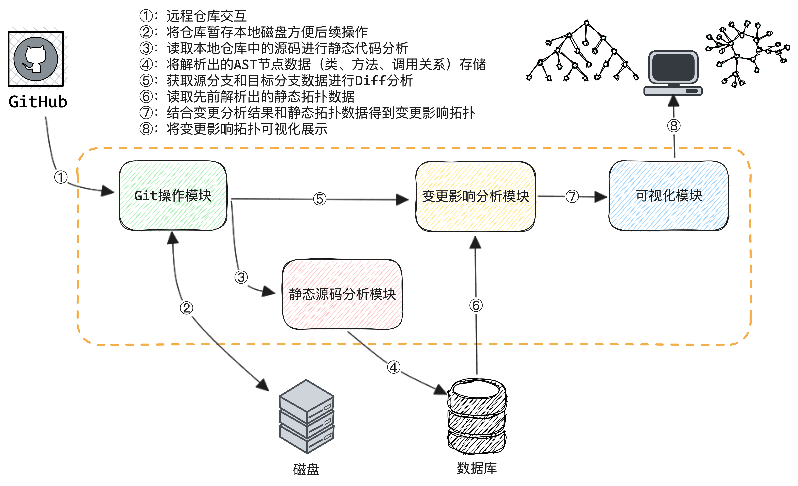
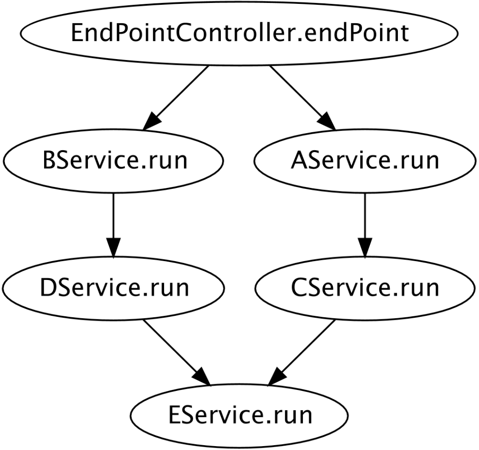
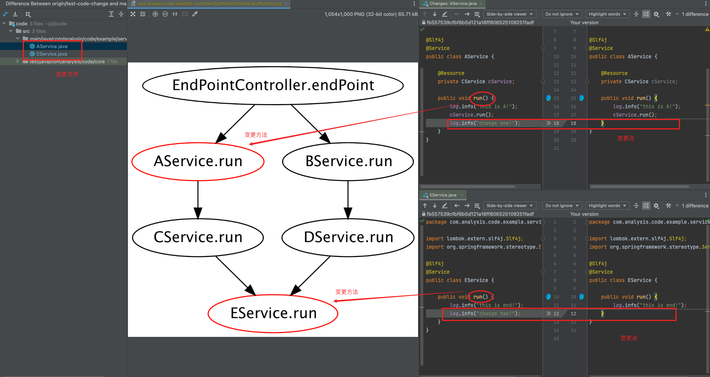

# 代码变更影响分析
## 背景描述
在开发过程中，每一次的代码改动都可能对程序的运行结果造成影响。越早评估出改动的影响面将更容易把风险扼杀在摇篮里，以更小的成本避免事故的发生。先用2个常见的开发场景来还原描述为什么我们需要“代码变更影响分析”：
- **场景1**：修改了方法①逻辑，以为只会影响入口A便只回归了相关的场景，上线后发现影响了入口B的逻辑，造成了线上事故;


- **场景2**：修改了方法②逻辑，并回归了所有已知的流量入口，但上线一段时间后出现了大量异常告警，原来是影响了定时任务和MQ消费逻辑。


“代码变更影响分析”具体的诉求可以描述为：**如何感知代码改动造成功能逻辑变化的影响范围，具体到影响了哪些类、方法、入口以及调用拓扑**。

## 实现方案
针对上述背景，本案例将使用源码静态分析的方式生成CallGraph，并提供代码变更影响分析能力。基本思路为：



## 关键代码
下面阐述基于Java的具体实现方案，完整源码获取：[java-call-graph-diff](https://github.com/Xiaoxie1994/java-call-graph-diff).

### 方法调用拓扑生成
变更影响判断基于CG，因此首先需要实现方法调用拓扑的可视化。生成CG的关键数据是方法和方法调用关系，基于前文编译器的理论知识，抽象语法树（AST）包含了完整的类、方法和方法调用相关的信息。因此整个方法调用拓扑的过程可以归纳为：**Code -> AST -> CallGraph**.
- **Code获取**：使用JGit将远程仓库拉取到本地；
```Java
private Repository remoteClone(String clonePath, File localPath) {
    if (StringUtils.isBlank(clonePath) || null == localPath) {
        return null;
    }
    log.info("remoteClone, clonePath:{}, localPath:{}", clonePath, localPath.getAbsolutePath());
    try (Git result = Git.cloneRepository()
            .setURI(clonePath)
            .setTransportConfigCallback(SSH_TRANSPORT_CONFIG_CALLBACK)
            .setDirectory(localPath)
            .call()) {
        Repository repository = result.getRepository();
        if (null != repository) {
            this.checkout(repository, "main");
        }
        return repository;
    } catch (Exception e) {
        log.error("cloneRepo error, path:{}", clonePath, e);
        return null;
    }
}
```
- **AST生成**：使用JavaParser解析项目所有源码文件得到类、方法和方法调用信息；
```Java
/**
 * 设置JavaParser解析配置
 */ 
private ParserConfiguration buildJavaParserConfig(List<String> sourcePath) {
    TypeSolver reflectionTypeSolver = new ReflectionTypeSolver();
    CombinedTypeSolver combinedSolver = new CombinedTypeSolver(reflectionTypeSolver);
    sourcePath.forEach(path -> {
        try {
            TypeSolver javaParserTypeSolver = new JavaParserTypeSolver(new File(path));
            combinedSolver.add(javaParserTypeSolver);
        } catch (Exception e) {
            log.error("load source path error, path:{}", path);
        }
    });
    JavaSymbolSolver symbolSolver = new JavaSymbolSolver(combinedSolver);
    return new ParserConfiguration().setSymbolResolver(symbolSolver);
}

/**
 * 获取解析出的接口或类相关信息
 */
private void parseInterfaceOrClass(AstEntity astEntity, String projectRootPath, String path) throws FileNotFoundException {
    CompilationUnit cu = StaticJavaParser.parse(new File(projectRootPath + "/" + path));
    // 类型声明解析
    List<ClassOrInterfaceDeclaration> classDeclarations = cu.findAll(ClassOrInterfaceDeclaration.class);
    if (CollectionUtils.isEmpty(classDeclarations)) {
        return;
    }
    // 类解析(只解析顶层类定义，其他内部类方法会归属到其下）
    ClassOrInterfaceDeclaration classOrInterfaceDeclaration = classDeclarations.get(0);
    ResolvedReferenceTypeDeclaration resolve = classOrInterfaceDeclaration.resolve();
    AstEntity.InterfaceOrClassDeclareInfo interfaceOrClassDeclareInfo = new AstEntity.InterfaceOrClassDeclareInfo();
    interfaceOrClassDeclareInfo.setClassFileRelativePath(path);
    interfaceOrClassDeclareInfo.setSimpleName(classOrInterfaceDeclaration.getNameAsString());
    interfaceOrClassDeclareInfo.setSignature(resolve.getQualifiedName());
    interfaceOrClassDeclareInfo.setInterface(classOrInterfaceDeclaration.isInterface());
    interfaceOrClassDeclareInfo.setAbstract(classOrInterfaceDeclaration.isAbstract());
    NodeList<ClassOrInterfaceType> implementedTypes = classOrInterfaceDeclaration.getImplementedTypes();
    // 实现接口信息
    if (CollectionUtils.isNotEmpty(implementedTypes)) {
        Set<String> signatures = this.getClassSignatures(implementedTypes);
        interfaceOrClassDeclareInfo.setImplementInterfaceSignatures(signatures);
    }
    // 继承类信息
    NodeList<ClassOrInterfaceType> extendedTypes = classOrInterfaceDeclaration.getExtendedTypes();
    if (CollectionUtils.isNotEmpty(extendedTypes)) {
        Set<String> signatures = this.getClassSignatures(extendedTypes);
        interfaceOrClassDeclareInfo.setExtendClassSignatures(signatures);
    }

    // 声明方法解析
    List<MethodDeclaration> methodDeclarations = classOrInterfaceDeclaration.findAll(MethodDeclaration.class);
    if (CollectionUtils.isNotEmpty(methodDeclarations)) {
        Map<String, AstEntity.MethodDeclareInfo> methodDeclareInfoMap = methodDeclarations.stream()
                .map(e -> this.parseMethod(e, classOrInterfaceDeclaration.getNameAsString()))
                .filter(Objects::nonNull)
                .collect(Collectors.toMap(AstEntity.MethodDeclareInfo::getSignature, Function.identity(), (v1, v2) -> v1));
        astEntity.getSignature2MethodDeclareMap().putAll(methodDeclareInfoMap);

        // 项目入口识别（目前仅通过注解识别spring http入口，可以扩展其他的模式）
        NodeList<AnnotationExpr> annotations = classOrInterfaceDeclaration.getAnnotations();
        if (CollectionUtils.isNotEmpty(annotations)
                && annotations.stream().map(AnnotationExpr::getNameAsString)
                .anyMatch(e -> "Controller".equals(e) || "RestController".equals(e))) {
            methodDeclareInfoMap.forEach((signature, methodDeclareInfo) -> {
                boolean isEndpoint = methodDeclareInfo.getAnnotationSimpleNames().stream()
                        .anyMatch(e -> "GetMapping".equals(e) || "PostMapping".equals(e)
                                || "PutMapping".equals(e) || "DeleteMapping".equals(e) || "RequestMapping".equals(e));
                if (isEndpoint) {
                    astEntity.getEndPointMethodSignatures().add(signature);
                }
            });
        }
    }
    astEntity.getSignature2InterfaceOrClassDeclareMap().put(interfaceOrClassDeclareInfo.getSignature(), interfaceOrClassDeclareInfo);
}

/**
 * 获取解析出的方法和方法调用相关信息
 */
private AstEntity.MethodDeclareInfo parseMethod(MethodDeclaration methodDeclaration, String classSimpleName) {
    try {
        ResolvedMethodDeclaration methodResolve = methodDeclaration.resolve();
        AstEntity.MethodDeclareInfo methodDeclareInfo = new AstEntity.MethodDeclareInfo();
        methodDeclareInfo.setSimpleName(methodDeclaration.getNameAsString());
        methodDeclareInfo.setSignature(methodResolve.getQualifiedSignature());
        methodDeclareInfo.setClassSimpleName(classSimpleName);
        methodDeclareInfo.setPublic(methodDeclaration.isPublic());
        // 填充方法参数信息
        if (CollectionUtils.isNotEmpty(methodDeclaration.getParameters())) {
            List<String> params = this.getParamSignatures(methodDeclaration);
            methodDeclareInfo.setParamTypeList(params);
        }
        // 填充注解信息
        NodeList<AnnotationExpr> annotations = methodDeclaration.getAnnotations();
        if (CollectionUtils.isNotEmpty(annotations)) {
            Set<String> annotationNames = annotations.stream().map(AnnotationExpr::getNameAsString).collect(Collectors.toSet());
            methodDeclareInfo.setAnnotationSimpleNames(annotationNames);
        }
        // 填充方法调用信息
        List<MethodCallExpr> methodCallExprs = methodDeclaration.getBody()
                .map(e -> e.findAll(MethodCallExpr.class))
                .orElse(Collections.emptyList());
        if (CollectionUtils.isNotEmpty(methodCallExprs)) {
            List<String> callMethodSignatures = methodCallExprs.stream().map(methodCallExpr -> {
                        try {
                            ResolvedMethodDeclaration resolve = methodCallExpr.resolve();
                            return resolve.getQualifiedSignature();
                        } catch (Throwable throwable) {
                            log.error("cannot resolve: {}", methodCallExpr.getNameAsString());
                            return null;
                        }
                    }).filter(StringUtils::isNotBlank)
                    .collect(Collectors.toList());
            methodDeclareInfo.setCallMethodSignatures(callMethodSignatures);
        }
        return methodDeclareInfo;
    } catch (Throwable e) {
        log.error("parseMethod error! name:{}", methodDeclaration.getNameAsString());
        return null;
    }
}
```
- **CallGraph生成**：选择起始节点，基于方法和调用关系生成方法调用拓扑图。



### 代码变更影响分析
通过Git Diff获取变更影响了哪些Java类文件，然后对变更前后的类文件进行源码解析得到类方法列表并对比前后差异得到变更影响的方法节点，最后结合之前生成的方法拓扑信息得到变更影响拓扑图。
- **变更文件获取**：使用JGit获取分支变更影响了哪些文件；
```Java
private List<DiffEntry> getBranchDiff(Repository repository, String targetBranch, String sourceBranch) {
    try (Git git = new Git(repository)) {
        AbstractTreeIterator oldTreeParser = this.prepareTreeParser(repository, sourceBranch);
        AbstractTreeIterator newTreeParser = this.prepareTreeParser(repository, targetBranch);
        if (null != oldTreeParser && null != newTreeParser) {
            return git.diff().setOldTree(oldTreeParser).setNewTree(newTreeParser).call();
        }
    } catch (Exception e) {
        log.error("getBranchDiff error, repoPath:{}, targetBranch:{}, sourceBranch:{}",
                repository.getDirectory().getPath(), targetBranch, sourceBranch, e);
    }
    return Collections.emptyList();
}
```
- **变更前后方法Diff**：使用JavaParser对变更前后的Java文件进行解析，获取变更前后类的方法列表。之后依次对照变更前后方法体信息（去除了注释影响，并格式化了代码），得到变更影响了哪些方法；
```Java
/**
 * 获取类对应所有方法信息
 */
private Map<String, MethodDeclaration> getAllMethodDeclaration(String projectRootPath, String path) throws FileNotFoundException {
    CompilationUnit cu = StaticJavaParser.parse(new File(projectRootPath + "/" + path));
    List<ClassOrInterfaceDeclaration> classDeclarations = cu.findAll(ClassOrInterfaceDeclaration.class);
    if (CollectionUtils.isEmpty(classDeclarations)) {
        return Collections.emptyMap();
    }
    ClassOrInterfaceDeclaration classOrInterfaceDeclaration = classDeclarations.get(0);
    List<MethodDeclaration> methodDeclarations = classOrInterfaceDeclaration.findAll(MethodDeclaration.class);
    Map<String, MethodDeclaration> declarationMap = Maps.newHashMapWithExpectedSize(methodDeclarations.size());
    methodDeclarations.forEach(methodDeclaration -> {
        ResolvedMethodDeclaration resolve = methodDeclaration.resolve();
        declarationMap.put(resolve.getQualifiedSignature(), methodDeclaration);
    });
    return declarationMap;
}
/**
 * 对比前后方法得到变更方法列表
 */
private static Set<String> findChangeMethods(Map<String, MethodDeclaration> oldMethodDeclarations,
                                                Map<String, MethodDeclaration> newMethodDeclarations) {
    PrinterConfiguration printerConfiguration = new DefaultPrinterConfiguration()
            .removeOption(new DefaultConfigurationOption(DefaultPrinterConfiguration.ConfigOption.PRINT_COMMENTS))
            .removeOption(new DefaultConfigurationOption(DefaultPrinterConfiguration.ConfigOption.PRINT_JAVADOC));
    DefaultPrettyPrinter printer = new DefaultPrettyPrinter(printerConfiguration);
    Set<String> changeMethods = Sets.newHashSet();
    oldMethodDeclarations.forEach((s, methodDeclaration) -> {
        MethodDeclaration newMethodDeclaration = newMethodDeclarations.get(s);
        if (null == newMethodDeclaration) {
            changeMethods.add(s);
            return;
        }
        String oldMethodBodyStr = printer.print(methodDeclaration.getBody().get());
        String newMethodBodyStr = printer.print(newMethodDeclaration.getBody().get());
        if (!StringUtils.equals(oldMethodBodyStr, newMethodBodyStr)) {
            changeMethods.add(s);
        }
    });
    return changeMethods;
}
```
- **变更分析生成**：结合方法拓扑生成变更影响拓扑图




